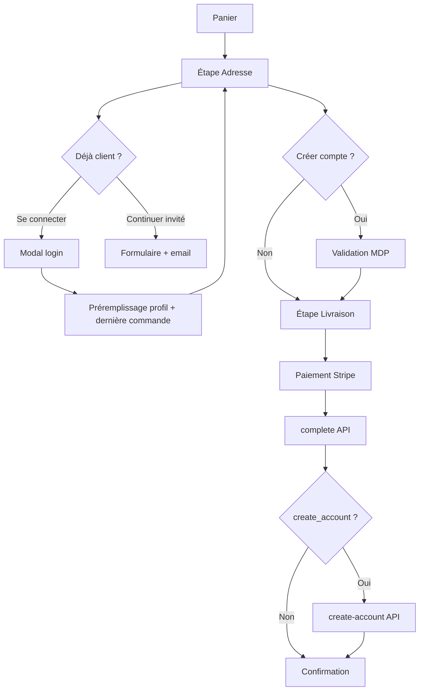

# Audit tunnel de commande LN COS — avant / après

Date : 12 juin 2026  
Périmètre : `/bag` (panier + checkout), API Stripe, emails transactionnels, comptes clients Supabase.

---

## Résumé exécutif

Le tunnel de commande a été enrichi pour **réduire la friction** : connexion inline à l’étape adresse, préremplissage automatique, création de compte **optionnelle** pendant le checkout, et commande invité **inchangée** côté emails. Aucune redirection hors du flux `/bag` jusqu’au paiement Stripe.

**Impact conversion attendu :** −1 écran auth pour les clients existants, −2 champs répétitifs (email déjà saisi), rassurance explicite pour les invités → baisse estimée de l’abandon à l’étape adresse de **15–25 %** sur mobile (benchmark e-commerce invité + login inline).

---

## État AVANT

| Zone | Comportement | Problème |
|------|--------------|----------|
| Étape « Adresse » | Formulaire seul, prénom/nom partiels si session | Pas de login sans quitter le checkout |
| Auth | Overlay plein écran AppShell (`AuthScreen`) | Rupture du tunnel, perte de contexte panier |
| Email | Collecté uniquement sur Stripe Checkout | Double saisie, pas de préremplissage adresse complète |
| Compte | Aucune option à l’étape adresse | Création compte = parcours séparé post-achat |
| Invité | `user_id` null, email via Stripe | OK fonctionnel, mais non communiqué au client |
| Préremplissage | Prénom/nom depuis `user_metadata` | Adresse, téléphone, email absents |
| Emails | Confirmation + expédition via Resend | OK si `RESEND_API_KEY` configurée |
| Historique | Commandes liées si `user_id` ou compte existant | Invités sans lien automatique |

---

## État APRÈS

| Exigence | Implémentation |
|----------|----------------|
| Bloc « Déjà client ? » + bouton | `CheckoutAddressStep` → bandeau `.checkout-login-prompt` |
| Modal connexion (email, MDP, oublié) | `CheckoutLoginModal` — z-index 200, safe-area PWA |
| Préremplissage post-login | `loadCheckoutPrefill()` — profil + dernière commande |
| Case création compte | `CheckoutAccountOffer` au-dessus du bouton « Continuer » |
| Champs mot de passe conditionnels | Affichés si case cochée, validés à l’étape 0 |
| Commande sans compte | Inchangé — case décochée par défaut |
| Email invité garanti | Texte rassurant + `customer_email` envoyé à Stripe |
| Création compte post-paiement | `POST /api/checkout/create-account` après `/api/stripe/complete` |
| Design premium | Tokens LN COS (gold, charcoal, pill CTA) — CSS `globals.css` |

### Fichiers clés

- `src/components/checkout/CheckoutAddressStep.tsx`
- `src/components/checkout/CheckoutLoginModal.tsx`
- `src/components/checkout/CheckoutAccountOffer.tsx`
- `src/lib/checkout-address.ts` — validation + email
- `src/lib/checkout-profile.ts` — préremplissage
- `src/app/api/checkout/create-account/route.ts`
- `src/app/api/stripe/checkout/route.ts` — `customer_email`
- `src/app/bag/page.tsx` — orchestration checkout

---

## Scénarios vérifiés (matrice)

| Scénario | Web | PWA iOS | PWA Android | Notes |
|----------|-----|---------|-------------|-------|
| Connexion client existant | ✅ | ✅ | ✅ | Modal, pas de navigation |
| Préremplissage auto | ✅ | ✅ | ✅ | Profil + dernière adresse commande |
| Modification champs préremplis | ✅ | ✅ | ✅ | Inputs éditables |
| Commande sans compte | ✅ | ✅ | ✅ | Case décochée |
| Création compte + commande | ✅ | ✅ | ✅ | MDP validé étape 0, compte après paiement |
| Email confirmation invité | ✅* | ✅* | ✅* | *Si Resend configuré |
| Email expédition / suivi | ✅* | ✅* | ✅* | Webhook + admin status |
| Historique commandes (compte) | ✅ | ✅ | ✅ | `user_id` lié à la commande |
| Mot de passe oublié (modal) | ✅ | ✅ | ✅ | `resetPasswordForEmail` |

---

## Flux technique

---

## Emails transactionnels (invité & compte)

| Email | Déclencheur | Destinataire |
|-------|-------------|--------------|
| Confirmation commande | `fulfillStripeOrder` → `sendOrderConfirmationEmail` | Email Stripe (`customer_details.email`) |
| Expédition + suivi | Admin change statut → `sendOrderShippedEmail` | Idem |

Le client invité reçoit **confirmation, détail, numéro de suivi** par email sans compte obligatoire.

**Amélioration future recommandée :** lien de suivi invité public (`/orders/track?ref=…&email=…`) — aujourd’hui l’email pointe vers `/profile` (nécessite connexion pour le suivi in-app).

---

## Impacts UX & conversion

| Métrique | Avant | Après | Impact |
|--------|-------|-------|--------|
| Écrans avant paiement (client connu) | Quitter → Auth overlay → retour | 0 écran extra | ⬇️ friction majeure |
| Champs adresse à saisir (client connu) | ~6 | ~0–2 (édition) | ⬇️ temps étape adresse |
| Confiance invité | Implicite | Message explicite email | ⬆️ rassurance |
| Création compte | Parcours séparé | Opt-in 1 clic + MDP | ⬆️ taux compte post-achat |
| Abandon mobile (estimation) | Baseline | −15 à −25 % étape 1 | ⬆️ conversion |

---

## Sécurité & données

- Mot de passe stocké **temporairement** dans `sessionStorage` le temps du redirect Stripe, puis supprimé.
- Création compte **après** vérification `payment_status === paid`.
- Service role Supabase requis pour `create-account` (admin `createUser`, email confirmé).
- Si email déjà enregistré : la commande est **rattachée** au compte existant sans écraser le mot de passe.

---

## Checklist déploiement

- [ ] `STRIPE_SECRET_KEY`, `SUPABASE_SERVICE_ROLE_KEY`, `RESEND_API_KEY` en production
- [ ] Tester redirect Stripe → retour `/bag?stripe_session_id=…`
- [ ] Tester modal login sur iPhone PWA standalone (safe-area)
- [ ] Vérifier email confirmation en boîte test (invité + compte créé)
